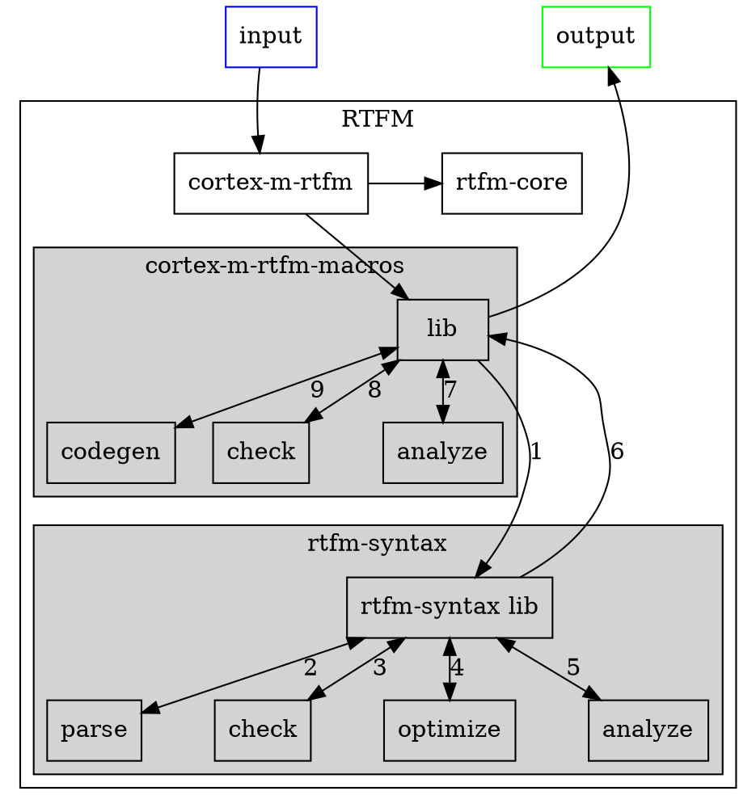

# Data design

> The data design describes structures that reside within the
> software. Attributes and relationships between data objects dictate the
> choice of data structures.

## Overview of data flow

